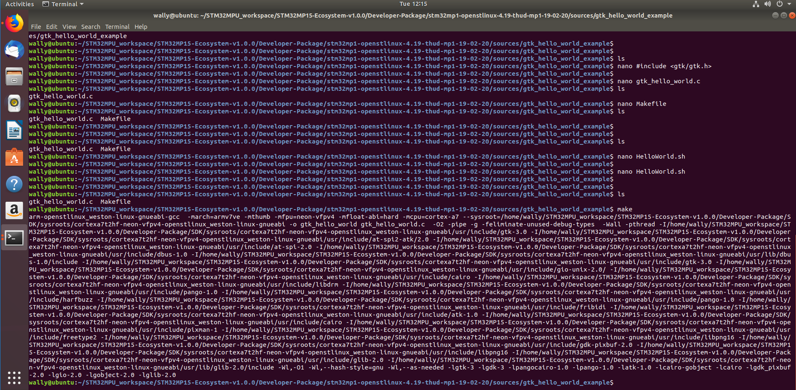

# stm32mp1WikiSetup
STM32MP1 Ubuntu 16.04 / 18.04 Setup Files

https://wiki.st.com/stm32mpu/wiki/Getting_started/STM32MP1_boards/STM32MP157C-DK2/Develop_on_Arm%C2%AE_Cortex%C2%AE-A7/Create_a_simple_hello-world_application

